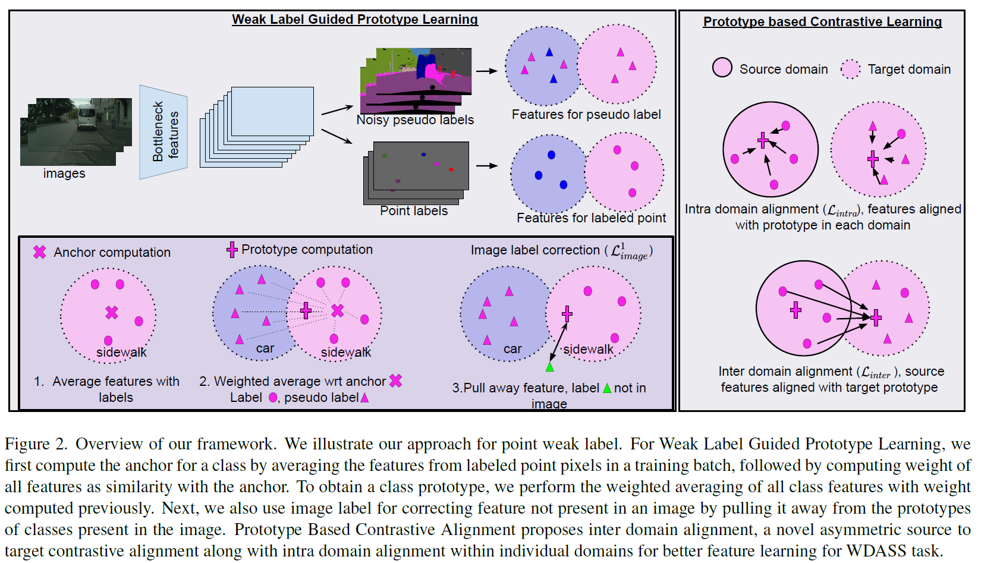
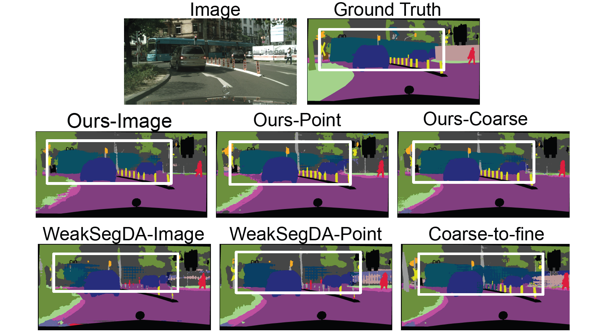

# Weakly-Supervised Domain Adaptive Semantic Segmentation with Prototypical Contrastive Learning
[](https://pytorch.org/)


This is the official repository accompanying the CVPR paper:

[Anurag Das](https://anurag-198.github.io/), [Yongqin Xian](https://xianyongqin.github.io/), [Dengxin Dai](https://vas.mpi-inf.mpg.de/dengxin/), and [Bernt Schiele](https://scholar.google.com/citations?user=z76PBfYAAAAJ&hl=en). **Weakly-Supervised Domain Adaptive Semantic Segmentation with Prototypical Contrastive Learning**. CVPR.

[Paper](https://openaccess.thecvf.com/content/CVPR2023/papers/Das_Weakly-Supervised_Domain_Adaptive_Semantic_Segmentation_With_Prototypical_Contrastive_Learning_CVPR_2023_paper.pdf) | [Video](https://www.youtube.com/watch?v=Arg8p0Zrf9A) | [Supplemental](https://openaccess.thecvf.com/content/CVPR2023/supplemental/Das_Weakly-Supervised_Domain_Adaptive_CVPR_2023_supplemental.pdf)


## Introduction

There has been significant effort in improving the performance of unsupervised domain adaptation (UDA) for semantic segmentation tasks. However, a substantial performance gap still exists when compared to supervised learning. In this research work, we introduce a novel framework aimed at reducing this performance gap by leveraging various forms of weak labels, including image, point, and coarse labels from the target domain.

## Methodology

### Learning Better Prototypes

Our approach centers around the idea of learning better prototypes that represent class features more effectively. By exploiting these weak labels, we enhance the quality of these prototypes.

### Contrastive Alignment

To bridge the domain gap, we employ a contrastive alignment strategy. This involves two key feature alignments:
1. Alignment of pixel features with prototypes within each domain.
2. Alignment of pixel features from the source domain to prototypes of the target domain in an asymmetric manner.

The asymmetric alignment is particularly beneficial, as it preserves the target domain's features during training. This preservation is essential when dealing with weak labels from the target domain.

<div align="center" style="display: flex; justify-content: center; align-items:center; align-content:center; width: 100%;">
    <div></div>
</div>


## Experiments and Results

We conducted extensive experiments on various benchmark datasets to evaluate the effectiveness of our framework. Our experimental results demonstrate a significant improvement compared to existing UDA approaches.

<div align="center" style="display: flex; justify-content: center; align-items:center; align-content:center; width: 100%;">
    <div></div>
</div>

## Usage

### Requirements:

#### For Conda:
Create a conda environment using the provided environment.yml file:

```bash
conda env create -f environment.yml
conda activate cu11
```
#### For Pip:
Create a virtual environment using the provided requirements.txt file:

```bash
python3 -m venv cu11
source cu11/bin/activate
pip install -r requirements.txt
```

### Training:

To replicate our experiments and results, you can use the following command:

```bash
python train.py --dataset cityscapes --result_dir logs/ --multiprocessing_distributed  --use_contrast  --bn_buffer --weak_label coarse --use_wl --imloss --improto
```

## Citation

If you find our work useful, please consider citing our paper:

```
@InProceedings{Das_2023_CVPR,
    author    = {Das, Anurag and Xian, Yongqin and Dai, Dengxin and Schiele, Bernt},
    title     = {Weakly-Supervised Domain Adaptive Semantic Segmentation With Prototypical Contrastive Learning},
    booktitle = {Proceedings of the IEEE/CVF Conference on Computer Vision and Pattern Recognition (CVPR)},
    month     = {June},
    year      = {2023},
    pages     = {15434-15443}
}
```

## License

This project is licensed under [fill in] - see the [LICENSE](LICENSE) file for details.